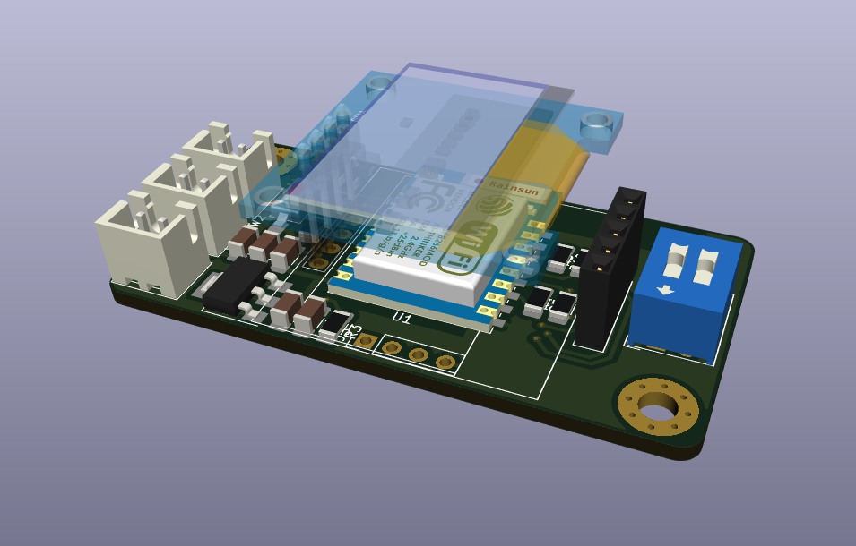
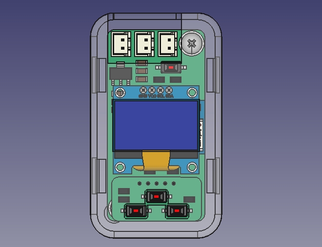

#### Paul's Hotplate Upgraded

This is another version of awesome pauls hot plate project that I am working on. I designed a pcb for the project because I don't have access to the board he used in his project.
The project is not completed yet and I should do some modifications on the enclosure, and I need to change the firmware to support the new PCB. Also the enclosure and the PCB is not tested.

External component libraries located [here](https://github.com/the-this-pointer/kicad-my-libraries)

###### TODO:

- Snap fit joints for the enclosure
- Firmware for new PCB
- 3D model for the female pin header used for keypad on main board.

#### Images

